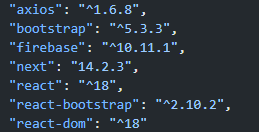
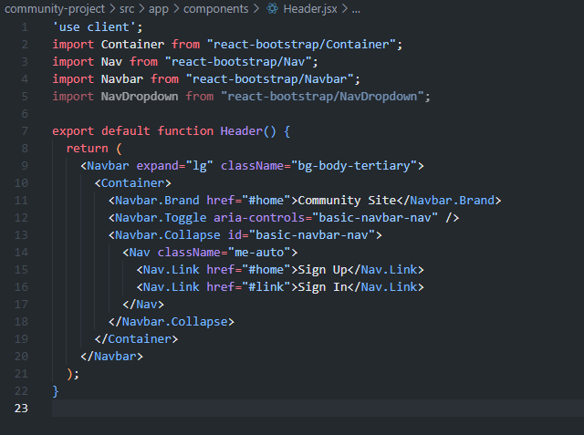
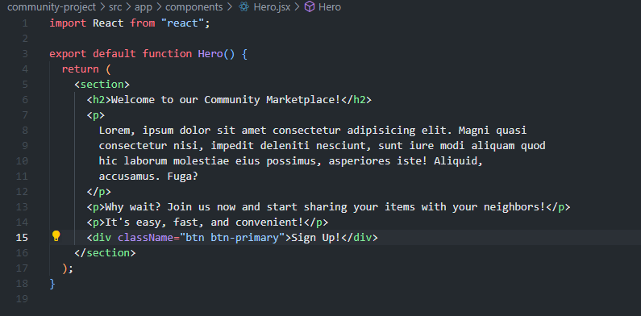
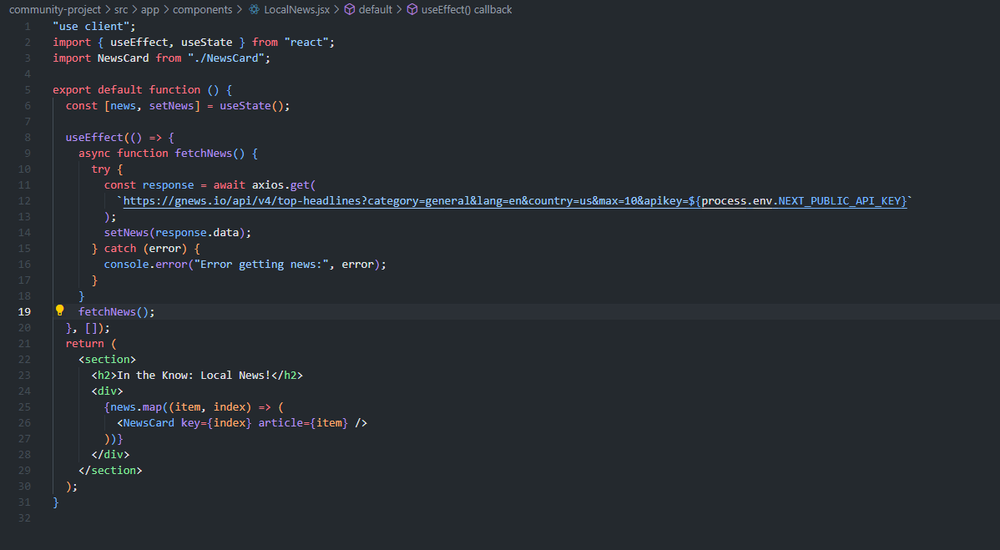
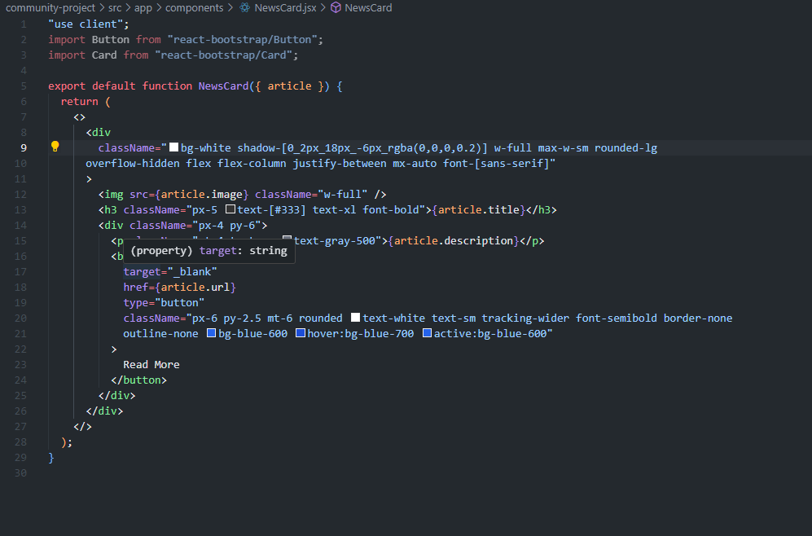
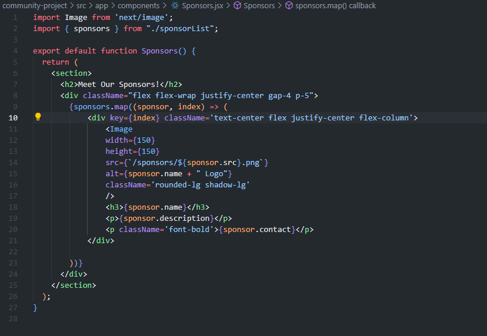

# Week 7 Assignment
## Day 1
### Tasks Completed
1. Set up basic file structure by running 'npx create-next-app@latest'.
2. Ensure the following are installed: 

3. Begin setting up basic components: Header, Hero, LocalNews, NewsCard, SponsorList, Sponsors
4. Configure components.

5. Set up /dashboard with page.jsx and components folder.

### Challenges Encountered
3. LocalNews will not display on the page.

## Day 2