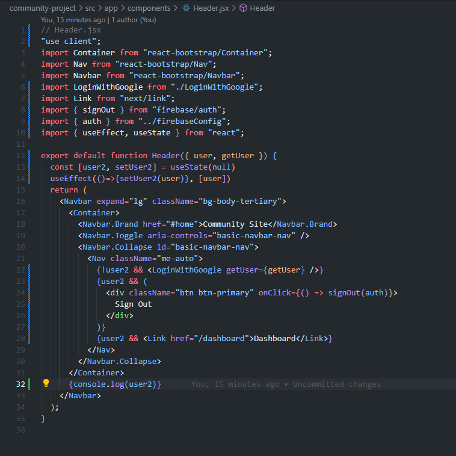

# Week 7 Assignment

## Day 1

### Tasks Completed

1. Set up basic file structure by running 'npx create-next-app@latest'.
2. Ensure the following are installed:
   
3. Begin setting up basic components: Header, Hero, LocalNews, NewsCard, SponsorList, Sponsors
4. Configure components.
   
   
   
   
   
5. Set up /dashboard with page.jsx and components folder.
   

### Challenges Encountered

1. LocalNews will not display on the page.

## Day 2

### Tasks Completed

1. Implement Login with Google functionality.
   
   
   
   
   
2. Implement Post to Page functionality.
   
   

### Challenges Encountered

1. Encountered issues with getting Google Login functionality to work. Solution: Was not properly passing user as props.

## Day 3

### Tasks Completed

1. Fixed functionality for user to post to the Dashboard page. Had to start completely from scratch. Deleted the PostToPage.jsx file and implemented Post and Posts .jsx files with code allowing user to post messages to the page, and view posts that have been made previously.
   
   
   
2. Fixed functionality for LocalNews to properly display onto the page.
   

## Day 4

### Tasks Completed

1. Added functionality for users to add comments to message posts.

2. Added styling to Home and Dashboard pages.

3. Added styling to components.

4. Added code comments.

Screenshots:

## Challenges Encountered

1. There was difficulty applying dark mode styling uniformly across the project.

Solution: Refined the Tailwind CSS class usage, ensuring that all relevant components had consistent dark mode styles applied, and utilized conditional rendering to switch styles based on the state or specific conditions.
Login Functionality with Firebase Authentication:

## Credits:

Credit to Lewis Benson for guiding us through this assignment, sharing the code for those of us who fell behind, and helping us to understand how this all works.
Credit to ChatGPT for assistance, code organization, and code comments.
